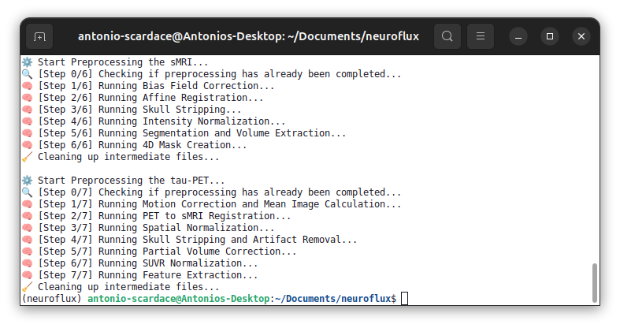
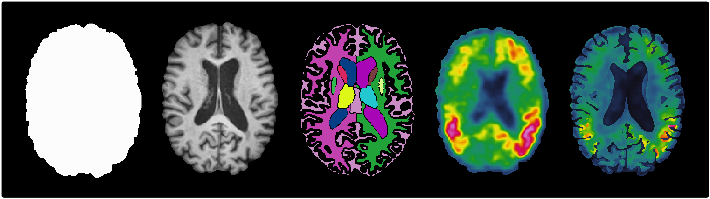
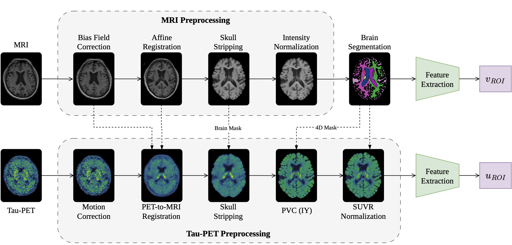

<div align="center">
    <a href="https://img.shields.io/badge/Python-3.9-blue?style=for-the-badge" alt="Python"></a>
    <a href="/docs/credits.txt"></a>
    <a href="https://github.com/antonioscardace/MRI-BrainAge/blob/master/LICENSE"></a>
    <a href="https://github.com/antonioscardace/Neuroflux/actions/workflows/cd-docker-publish.yml"></a>
</div>
<br/>

**neuroflux** is a CPU-based preprocessing pipeline for paired structural MRI (**sMRI**) and **tau-PET** data. Built on open-source neuroimaging tools, it automatically transforms raw scans from the same visit into standardized, analysis-ready derivatives. The pipeline combines multiple preprocessing steps to generate standardized multimodal imaging **derivatives** and quantitative regional **features**. Designed for reproducible neuroimaging workflows, neuroflux provides a fully automated and containerized pipeline.

<p align="center">
  
  
</p>

## Installation

A dedicated virtual environment, such as [Anaconda](https://www.anaconda.com/), is recommended to ensure a clean and consistent Python environment and avoid dependency conflicts, while [Docker](https://docs.docker.com/get-docker/) is required to run the full pipeline.<br/>
Clone the repository and install the package in editable mode:

```console
git clone https://github.com/antonioscardace/neuroflux.git
cd neuroflux/
pip install -e .
```

## Usage

sMRI and tau-PET scans must be acquired from the **same subject** and **within 6 months** of each other.<br/>
To run the preprocessing, run the following command:

```console
python3 neuroflux.py \
  --mri_path /path/mri_raw.nii.gz \
  --pet_path /path/pet_raw.nii.gz \
  --template_path /path/mni152_template.nii.gz \
  --atlas_map_path /path/atlas_map.json \
  --mri_output_dir /path/mri \
  --pet_output_dir /path/tau_pet \
  [OPTIONS]
```

## Output

An example of the resulting output structure is shown below:

```
/path/mri/
├── warped.nii.gz        # MRI registered to the standard template space.
├── preprocessed.nii.gz  # Preprocessed and intensity-corrected MRI.
├── brain_mask.nii.gz    # Binary brain extraction mask.
├── segm.nii.gz          # 100-ROI anatomical segmentation.
├── segm_4d.nii.gz       # One-hot encoded 4D ROI segmentation.
└── volumes.csv          # ROI-level regional volume measurements.
```

```
/path/tau_pet/
├── warped.nii.gz.       # PET registered to the corresponding MRI space.
├── skullstrip.nii.gz    # Skull-stripped PET image.
├── pvc.nii.gz           # Partial Volume Corrected PET image.
├── suvr_norm.nii.gz     # Intensity-normalized PET image expressed as SUVR.
└── uptakes.csv          # ROI-level tracer uptake measurements.
```

## Pipeline

<p align="center"></p>